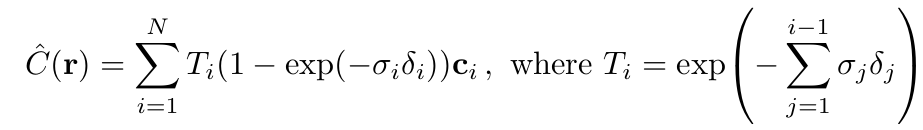
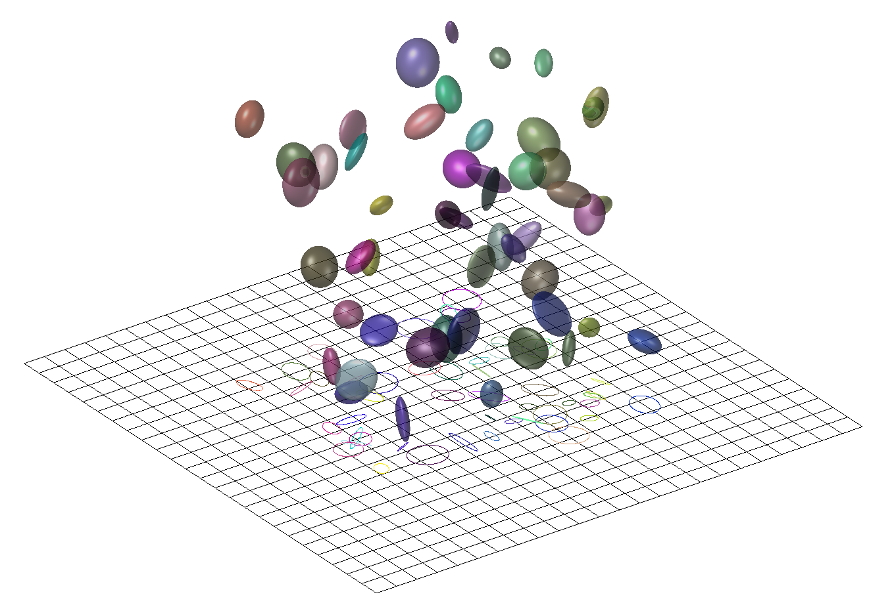
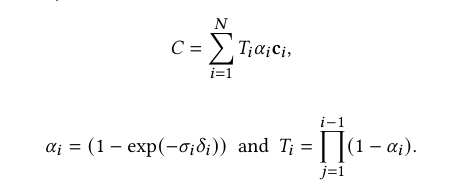
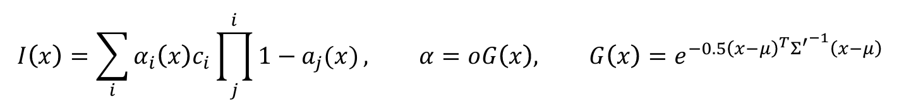

# 3DGS 紹介

3DGS (3D Gaussian Splatting) は2023年8月に提案された新しい Novel View Synthesis 技術であり、SIGGRAPH Asia 2024 で発表されました。3D Reconstruction、Generative AI、VR/AR、自動運転などの分野に応用可能です。CV や CG の業界では、以前流行していた NeRF に代わる技術として定着しており、現在、3DGS の論文引用数は7000に達しています。

## 関連研究 - NeRF

3DGS の以前の関連研究として NeRF (現在の引用数は16000) があります。その主な貢献は、Graphics の Volume Rendering 技術を Differentiable Rendering に応用したことです (3DGS もこの式を使用しています)。Volume Rendering の過程は直接計算可能な離散積分であるため、数学的に微分可能です。NeRF と 3DGS で使用される Volume Rendering の式は以下の通りです：

。
計算時はその離散形式を採用します：

ここで C(r) は Ray r (r(t)=o+td) の画像平面上の色です。T(t) は Ray 上の位置 t における Transmittance (どれだけの光が通過できるか) を表します。$\delta (r(t))$ はその位置の密度を表します。c(r(t),d) は Ray 上の t における方向 d の色を表します (コードでは Spherical Harmonics 係数で表されます。Spherical Harmonics は Graphics でよく使われる基底関数です)。$t_n$ は Near Plane、$t_f$ は Far Plane を表します。Ray r の色は Near Plane から Far Plane までの積分を計算して得られます (この式は Volume Rendering における Absorption-Emission Model です)。NeRF の貢献は、MLP を用いて空間内の任意の点の密度と色を予測することです。カメラ/目からピクセルに向けて Ray を飛ばし、Ray 上で複数の点をサンプリングし、MLP でそれらの点の密度と色を予測し、最後に上記の積分を計算して色を得ます。MLP を学習させることで、空間内の任意の位置の密度と色を予測する良好な近似関数が得られます。

## 3DGS Framework

3DGS は NeRF の後継として、同様の Volume Rendering 原理を使用していますが、Gaussian Splatting を使用して Rendering 速度を向上させている点が異なります。著者は CUDA 上で Gaussian Splatting の高速な Rasterization と Tile-Based Rendering を実装し、学習時間を NeRF 時代の12時間 (Vanilla NeRF のみ、Instant-ngp 等は除く) から数十分まで短縮しました。3D Gaussian Splatting（3DGS）の全体的な Framework は End-to-End の Pipeline であり、その核心的なアイデアは3Dシーン全体を数百万個の学習可能な3D Gaussian で表現し、それらを画像平面に投影して NeRF の Volume Rendering 式を用いてピクセルの色を計算することです。これらの Gaussian はシーンの基本単位であり、それぞれが3D空間内の位置、形状と方向を表す Covariance Matrix、View-Dependent な Spherical Harmonics で表される色、および Opacity などの属性を持っています。

3DGS の計算式は NeRF の式と同じですが、実際の Rendering ではその離散形式を使用し、原論文では以下のように書き直されています：

$\alpha$ は Opacity と理解できますが、実際の計算では2D Gaussian 分布を乗算する必要があるため、実際の式は以下のようになります：

ここで G は2D Gaussian 分布関数で、画像平面の対応するピクセルに投影された Gaussian の2D分布を表します。o は Gaussian の密度、$ {\textstyle \sum_{}^{\acute{} }} $ は画像平面に投影された Gaussian の2D Covariance Matrix です。
しかし MLP とは異なり、3DGS は画像の各ピクセルに Ray を飛ばして数百点をサンプリングする必要はありません。3DGS の全プロセスは以下の7つのステップに分かれます：

- Initialization: 入力された RGB 画像シーケンスに基づき、SfM アルゴリズム (COLMAP) を使用して初期の Sparse Point Cloud と Camera Pose を推定します
- Gaussian Modeling: Point Cloud の各点は3D Gaussian 分布を表し、初期の Point Cloud を一連の 3D Gaussian Ellipsoid に変換します
- Frustum Culling: 現在のカメラパラメータに基づき、Frustum 範囲外の 3D Gaussian を除外します
- Differentiable Projection: 残った 3D Gaussian を Differentiable な Affine Transformation を通じて 2D 画像平面に投影します
- Tile-Based Rasterization: 投影された Gaussian を画像ブロックごとに整理し、Tile-Based Rasterizer を採用して並列的かつ順序付けられた Blending Rendering を実現します
- Loss Calculation & Backpropagation: Rendering 出力と実画像を比較し、Loss を計算して Backpropagation により Gaussian の各属性パラメータを最適化します
  

# 3DGS 先行研究:

## Semantics-Controlled Gaussian

Semantics-Controlled Gaussian  Splatting for Outdoor Scene Reconstruction and Rendering in Virtual Reality

本論文では、3D Gaussian に Semantic 情報を埋め込むことで、大規模な屋外シーンの高品質な Reconstruction を実現し、ユーザーが VR 内で特定のシーン要素 (空、水面など) を削除・置換することを可能にしました。また、最新の Game Engine とシームレスに統合可能です。

欠点: この手法は事前に定義された Semantic Label に依存しており、多様なシーンでの適用性が制限されます。

## VRSplat

VRSplat: Fast and Robust Gaussian Splatting for Virtual Reality

VRSplat は視線位置に基づいて画像を異なるサイズの Tile に分割します -- 中心の高解像度領域には 16x16 ピクセルの小さな Tile を使用し、周辺の低解像度領域には 32x32 ピクセルの大きな Tile を使用します。さらに Visibility Culling を利用して VR ディスプレイに描画されない部分を除外します。

欠点：この手法は物体の詳細部分での表現が不十分であり、Rendering 効率もさらに改善の余地があります。

# 研究目標：

3DGS をリアルタイム VR システムに応用し、ユーザーがシーン内の物体を簡単に編集（削除、置換など）できるようにすることを目指します。私の研究目標は以下の2点です：

1. 3DGS シーンの編集性の向上: 現在の 3DGS は主に高品質なシーン Reconstruction と Rendering に焦点を当てていますが、物体に対する Semantic 理解が不足しているため、ユーザーが特定の物体を直接編集することが困難です。例えば、ユーザーがシーン内の特定の椅子を削除したい場合、3DGS は椅子の Semantic 情報を識別できないため、手動で Gaussian を選択して削除する必要があります。これは非効率であり、ミスも起こりやすいです。
2. 複雑なシーンにおける 3DGS の Rendering 効率の向上: 3DGS は Rendering 速度を大幅に向上させましたが、複雑なシーンでは依然として遅延の問題があります。特に VR アプリケーションでは、低遅延がユーザー体験の鍵となります。したがって、リアルタイム Interactive の需要を満たすために、Rendering Process をさらに最適化する必要があります。

# 研究手法:

## Open-Set Semantic Detection の導入：

Open-Set Semantic Detection とは、モデルが学習済みの既知のクラスを分類するだけでなく、学習時に見たことのない未知のクラスを識別・拒否できることを指します。この分野で優れた研究として CLIP があります。OpenAI が提案した CLIP は、Contrastive Learning を通じて画像とテキストを同一の特徴空間にマッピングし、視覚と言語情報を関連付けることで Open-Set Semantic Detection を実現します。CLIP は大規模データセットで学習されており、強力な汎化能力を持ち、Text Prompt を通じて画像内の様々な物体やシーンを識別できます。私の第一の研究手法は、CLIP モデルを導入し、Text Prompt を通じてシーン内の未知の物体を識別し、それらを特殊処理（削除や置換など）することで、3DGS の編集性を向上させることです。

また、シーン内の様々な物体を識別・分割するために、学習済みの分割モデル Segment Anything Model (SAM) を使用します。SAM は画像内の異なる領域を正確に分割でき、CLIP の Semantic 理解能力と組み合わせることで、シーン内の未知の物体の検出と分割を実現できます。

シーン内の各 Gaussian に新しい低次元 Semantic Feature Vector を挿入します。Renderer を通じて Rendering した後、低次元の Semantic Feature Map が得られます。Decoder を通じて CLIP Semantic Feature Vector と同次元の Feature Map にデコードし、Pixel-Level の Semantic 表現を実現します。この方法により、CLIP+SAM モデルの出力との Loss を計算し、Gaussian 内の Semantic Feature 表現を最適化できます。

## LOD の導入:

LOD (Level of Detail) とは、観察距離に応じてモデルの詳細レベルを動的に調整する手法です。3DGS の場合、カメラと Gaussian の距離に応じて、Gaussian の数と分布密度を動的に調整し、視覚品質を維持しつつ Rendering 効率を向上させることができます。具体的には、カメラが特定の領域に近づいた場合、その領域内の Gaussian の数と詳細レベルを増やし、より豊富な視覚情報を提供します。逆に、カメラが離れた場合は、Gaussian の数と詳細レベルを減らし、計算リソースを節約します。

LOD メカニズムを導入するには、事前にシーン全体を Voxel 化 (Sparse Voxel Octree などの手法を使用) し、各 Voxel 内の異なる詳細レベルの Gaussian 表現を計算しておく必要があります。Rendering 時に、カメラ位置に応じて適切な詳細レベルを動的に選択して Rendering します。

