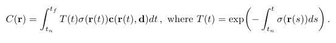
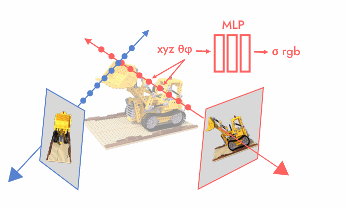
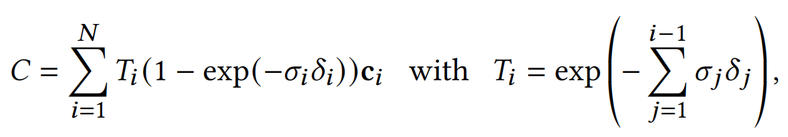
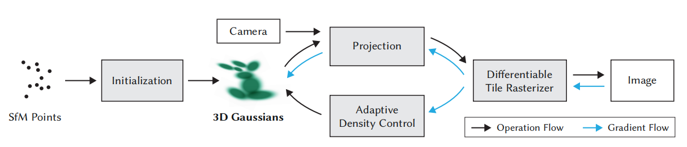
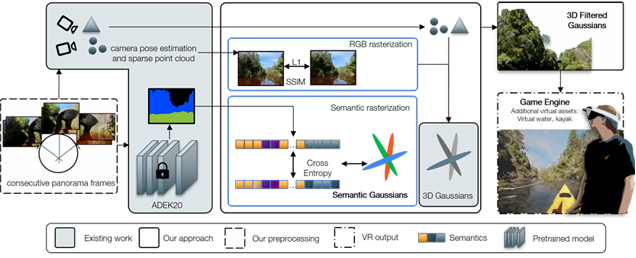
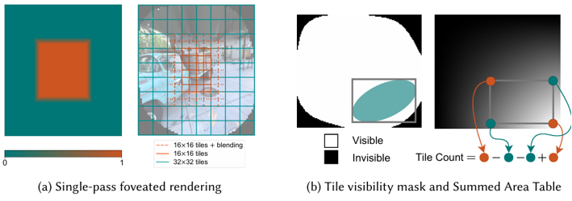

# 3dGS 介绍

3dgs(3d Gaussian Splatting)是23年8月份提出的一种新的新视角合成技术，主要应用在三维重建领域，在cv和cg界基本取代了此前流行的同为新视角合成技术的Nerf，截止目前，3dgs的论文引用数已达近8000，该论文还获得了siggraph 2024 best paper。

## 前置工作-Nerf

3dgs之前的工作是Nerf(截止目前引用数已达16000)，它的主要的贡献是把图形学中的体渲染技术应用在了可微分渲染上(3dgs也沿用了这个公式)，因为体渲染的过程是一个可以直接计算的离散积分，所以数学上直接可微。在Nerf和3dgs用到的体渲染公式如下：
这里的C(r)就是射线r(r(t)=o+td)在成像平面上的颜色，c()T(t)代表了射线上位置t处的透射率（可以理解为有多少光线能够传过去），$\delta (r(t))$代表了此处的密度,c(r(t),d)代表了射线上t处方向d的颜色(代码中用球谐系数表示，球谐函数是图形学中常用的基函数)。$t_n$代表了近平面，$t_f$代表了远平面。射线r的颜色就是计算从近平面到远平面上的积分得出(该公式就是体渲染中的吸收-发射模型)。Nerf的贡献是用一个MLP去预测空间中任意点的密度和颜色，从摄像机/眼睛像像素处发射一条射线，然后在射线上采样多个点，用MLP去预测所有这些点的密度和颜色，最后计算上述积分即可得到颜色，通过训练该MLP即可得到良好的拟合函数去预测空间任意位置的密度和颜色。

## 3dgs框架

3dgs作为Nerf的后继者，依然沿用了这套体渲染原理，不同的是使用了Gaussian Splatting加快渲染速度。论文作者同时在cuda上实现了Gaussian Splatting的快速光栅化和Tile-Based Rendering，使得训练速度从Nerf时期的12小时(此处仅指Vanilla Nerf，诸如Instant-ngp的加速工作不考虑)降低到了几十分钟。3D Gaussian Splatting（3DGS）的整体框架是一个端到端的pipline，其核心思想是将整个三维场景表示为数百万个可学习的3D高斯球。这些高斯球作为场景的基本表示单元，每个都拥有各自的属性，包括3D空间中的位置、描述其形状与方向的协方差矩阵、以及view-depedent的球谐函数所表示的颜色和不透明度。
3dgs计算的公式就是Nerf的公式，实际渲染使用其离散形式，具体如下：

但是和MLP不一样，3dgs不需要向图像的每个像素发射一条射线，然后在每条射线上采样数百个点去计算，3dgs的整个流程可以分为7个步骤:

- 初始化：基于输入的RGB图像序列，通过sfm算法（COLMAP）估计初始稀疏点云及相机位姿；
- 高斯空间建模：将初始点云转换为一系列3D高斯椭球；
- 视锥体筛选：根据当前相机参数，剔除位于视锥体范围之外的3D高斯椭球；
- 可微分投影：将保留的3D高斯椭球通过可微分的仿射变换投影至2D图像平面；
- 分块光栅化：将投影后的高斯椭球按图像块组织，并采用基于Tile-Based的光栅化渲染器，实现并行、有序的混合渲染；
- 损失计算与反向传播：比较渲染输出与真实图像，计算loss并通过反向传播优化高斯椭球的各项属性参数；
  

# 3dGS 先行研究:

## Semantics-Controlled Gaussian

Semantics-Controlled Gaussian  Splatting for Outdoor Scene Reconstruction and Rendering in Virtual Reality

该论文通过在 3D 高斯点中嵌入语义信息，实现了对大规模户外场景的高质量重建，并允许用户在虚拟现实（VR）中对特定场景元素（如天空、水面）进行移除与替换。可以与现代游戏引擎无缝集成。

## VRSplat

VRSplat: Fast and Robust Gaussian Splatting for Virtual Reality

VRSplat根据人眼注视点将图像划分为不同大小的瓦片（Tiles）——中心高分辨率区域使用 16x16 像素的小瓦片，外围低分辨率区域使用 32x32 像素的大瓦片，并利用visibility culling剔除掉不在VR显示器上渲染的部分。

# 研究方法:
## 引入开集语义检测：
开集语义检测是指模型不仅能正确分类训练时见过的已知类别，还能识别并拒绝分类训练时未见过的未知类别样本。这方面做的比较好的工作有CLIP，由OpenAI提出的CLIP模型通过对比学习将图像和文本映射到同一特征空间，使得模型能够理解和关联视觉与语言信息，从而实现开集语义检测。CLIP在大规模数据集上进行训练，具备强大的泛化能力，可以通过 text prompt 来识别图像中的各种对象和场景。我的第一个研究方法就是引入CLIP模型，通过text prompt识别场景中的未知对象，并将这些对象进行特殊处理（如剔除或替换），从而提升3DGS的可编辑性。
另外，为了识别并分割场景中的各种物体，需要使用预训练好的分割模型Segment Anything Model(SAM)。SAM模型可以对图像中的不同区域进行精确分割，结合CLIP的语义理解能力，可以实现对场景中未知对象的检测与分割。
对于场景中的每个gaussian球，我们都会插入一段新的低维语义特征向量，在经过渲染器渲染后会得到低维的Semantic Feature Map，通过解码器将其解码为和CLIP语义特征向量同维度的Feature Map，从而实现像素级的语义表示。通过这种方式，我们可以将其与CLIP+SAM模型的输出计算loss，从而优化高斯球中的语义特征表示。
## 引入LOD:
LOD是Level of Detail的缩写，指的是根据观察距离动态调整模型细节层次的方法。对于3DGS来说，可以根据摄像机与高斯球之间的距离，动态调整高斯球的数量和分布密度，从而在保证视觉质量的前提下提升渲染效率。具体来说，当摄像机靠近某个区域时，可以增加该区域内高斯球的数量和细节层次，以提供更丰富的视觉信息；反之，当摄像机远离某个区域时，可以减少该区域内高斯球的数量和细节层次，以节省计算资源。
引入LOD机制，就需要先提前对整个场景做体素化(可以使用Sparse Voxel Octree等方法)，然后提前计算好每个体素内的不同细节层次下的高斯球表示。在渲染时，根据摄像机位置动态选择合适的细节层次进行渲染。